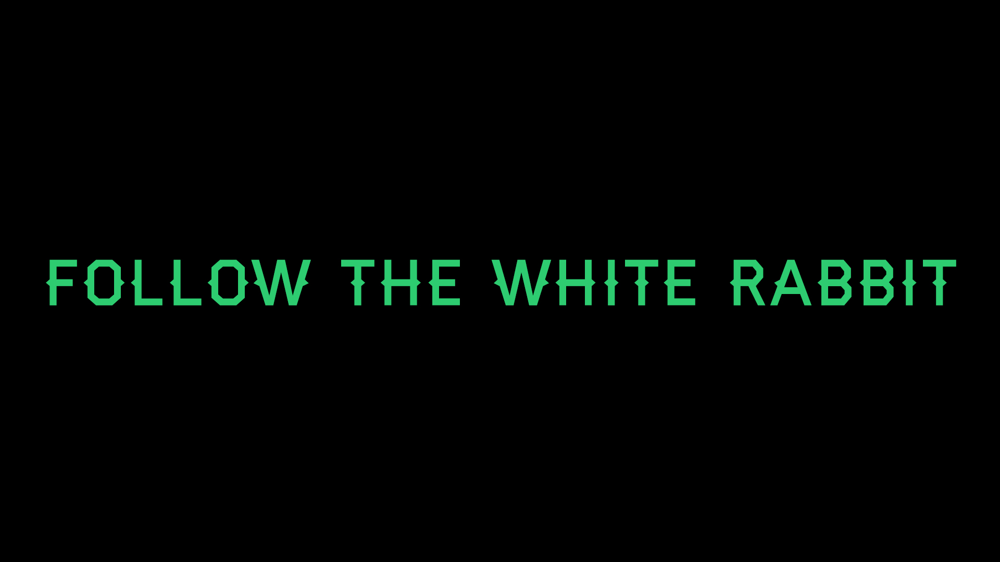

## Hi, I'm Marlon Brendo. Nice to meet you. 

*Graduating in Information Systems at UFU. I am a Backend  programmer and a student of DevOps Engineering . I have a great passion for Backend development, low level programming, open source, linux and everything that involves the world of binaries ❤️❤️*

:star: I don't want to believe, I want to know. - Carl Sagan

Things I like to do:

- API(Application Programming Interface)
- Scripts
- Applications
- Backend development

## 🔧 Technologies & Tools

		 					 					 	

About me:

-   Interested in everything **DevOps Engineer, Backend, Software Engineering**
-   :seedling: Currently learning Next.js, Nodejs and React
-   :heart: Open Source Software
-   :penguin: **Linux** ... **KISS**
-   💡 Always helping and transmitting the knowledge acquired with humility
-   📫 How to contact me: [My Linkedin](https://www.linkedin.com/in/marlon-brendo-ramos-204763225/), [My E-mail](mailto:marlonbrendo2013@gmail.com?subject=Olá,%20vim%20do%20teu%20site)
-   ⚡ Curiosity: I'm always looking to learn new ideas and technologies. Seeking excellence every day and approaching the state of the art as much as possible.

## &#x1f4c8; GitHub Stats

