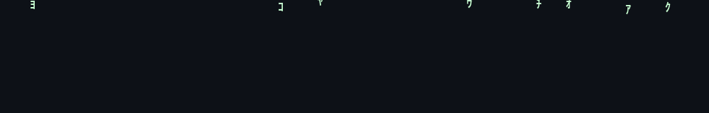

  

<!-- 

  

 -->

## Hi, I'm Marlon Brendo 

Information Systems graduate at **UFU** and Full Stack developer, with a strong bias toward the **backend**: APIs, low-level programming, Linux and everything that lives close to the binary world. Open source enthusiast. Always chasing the state of the art.

> ⭐ *"I don't want to believe, I want to know."* — Carl Sagan

- 🔭 Interested in **Backend, Software Engineering, Cybersecurity and Machine Learning**
- 🧩 What I enjoy building: APIs, scripts, ML experiments and backend services
- 🐧 **Linux** user... **KISS**
- 💚 Open Source Software
- 💡 I like to figure out how things work under the hood — and share what I learn
- 📫 Reach me: [LinkedIn](https://www.linkedin.com/in/marlon-brendo-ramos-204763225/) · [E-mail](mailto:marlonbrendo2013@gmail.com?subject=Olá,%20vim%20do%20teu%20site)

## 🔧 Technologies & Tools

**Languages**

 

**Frameworks & Libraries**

**Infrastructure & Tools**

## 💊 GitHub Summary

  

  <a href="https://github.com/MarlonBrendonx">
    

        
    

  </a>

  

  

  

